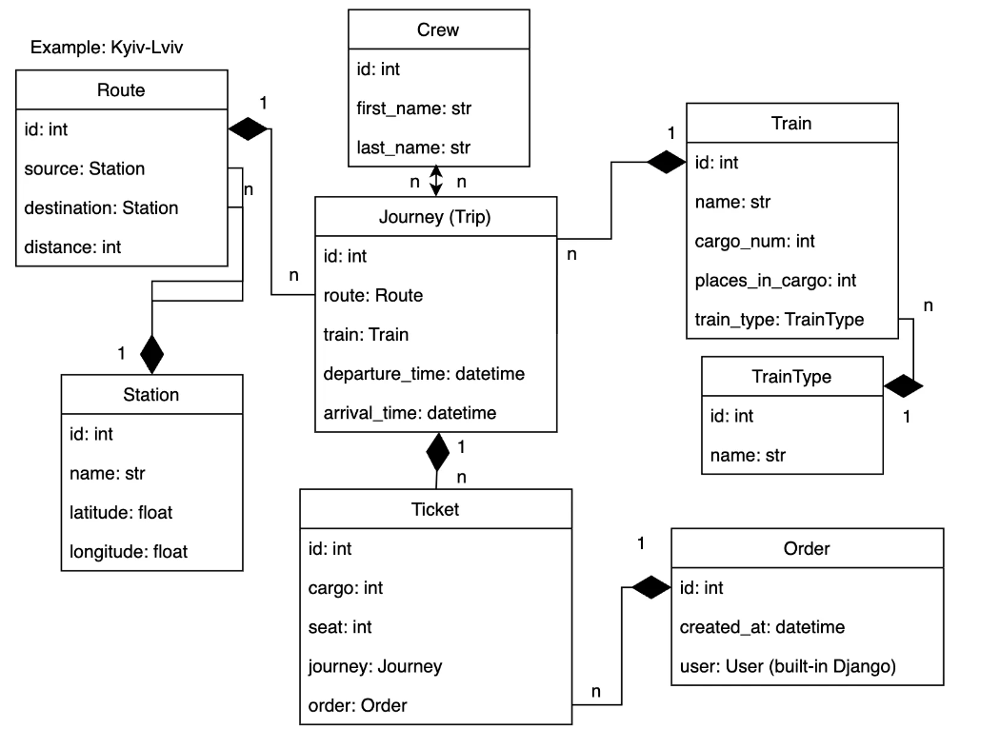

# Train Station API🚈
___

The Train Station API is a powerful and versatile application designed to provide developers, businesses, and transportation enthusiasts with easy access to information related to train stations, schedules, and services. Whether you're building a travel app, a website, or a logistics management system, our Train Station API is the perfect solution to incorporate railway data seamlessly into your projects.

## Installation
___

Python3 must be already installed.

```shell
git clone https://github.com/Barsh4ec/train-station-API.git
python3 -m venv venv
source venv/bin/activate  # On Windows, use venv\Scripts\activate
pip install -r requirements.txt
python manage.py migrate
python manage.py runserver
```

## Run with Docker
___

To run the project using Docker, follow these steps:

- Create a .env file using .env.sample and specify environment variables inside the .env to run the project with Docker.
- Run the following command to build and start the Docker containers:
```shell
docker-compose up --build
```

## Features based on user role
___
Anonymous User:

* Can see Stations, Routes and Journeys
* Can't create anything

Authenticated User:

* Can see Stations, Routes, Journeys and Orders
* Can create, delete and update orders

Admin User:

* Has full access to all kind of operations


#### Admin user credentials
```shell
email: admin@gmail.com
password: qwerty
```
### For creating new account follow these endpoints:
- Create user - /api/user/register
- Get access token - /api/user/token


## Features
___
- Interaction with JWT Token is available with these endpoints:
  - /api/user/token/ - for obtaining user's token
  - /api/user/token/refresh/ - for refreshing token after it's lifetime expire
  - /api/user/token/verify/ - for verifying received token
- DRF Documentation is located at these endpoints:
  - /api/schema/
  - /api/doc/swagger/ 
  - /api/doc/redoc/
- Automatically calculate distance between stations using latitude and longitude
- Managing orders and tickets
- Access for anonymous users
- Filtering data by different parameters


## DB structure
___
